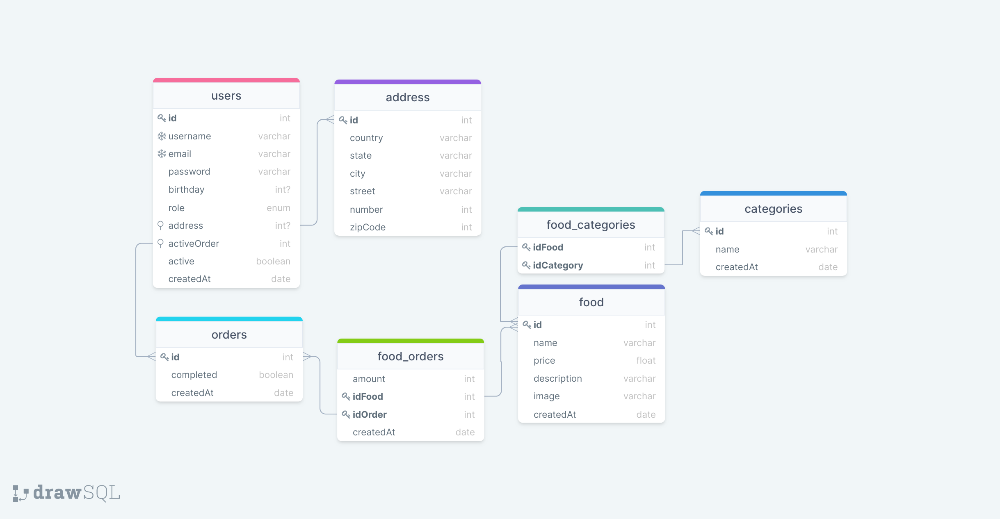

# Peruvian Wishes

A BackEnd aplication inspired by Rappi.

### Getting Started

* In a terminal, install all the dependencies by executing the following command:

```bash
npm install
```

* Then, create a `.env.development` file taking into consideration `.env.example`, filling all the assignments.

* Finally, spawn a database, run the migrations, create the superuser, and run the development server by executing the following commands:

```bash
docker compose -f docker-compose.dev.yaml up # spawns a MySQL database
npm run migrate:mysql:dev
npm run createsuperuser:dev
npm run dev
```

* If you want to run in a isolated production environment, create a `.env.production` file taking into consideration `.env`, and run the production server by executing the following commands:

```bash
npm run migrate:mysql:prod
npm run createsuperuser:prod
docker compose up
```

Este sistema fue desarrollado haciendo uso de la **Arquitectura** `Modelo Vista Controlador (MVC)`.

El sistema fué desarrollado usando estas tecnologías:

* `HTML` y `CSS` a través del framework `TailwindCSS`.
* `NodeJS` para el backend a través del framework `Express`.
* `PostgreSQL` para la base de datos.
* El ORM `Prisma` para la validación y modelado de objetos del modelo.
* `Handlebars` para renderizar las vistas.
* `JavaScript` para el frontend.
* `ESLint` para la estandarización de código.
* El Servidor SMTP `mailtrap` para el envío de Correos Electrónicos.
gi* El despliegue fue realizado en la Plataforma como Servicio (PaaS) `Heroku`.

**Librerias empleadas en el lado del Servidor:**

* `@prisma/client`
* `bcrypt`
* `dotenv`
* `express`
* `express-flash-message`
* `express-handlebars`
* `express-session`
* `nodemailer`
* `nodemailer-express-handlebars`
* `prisma`

## Modelado del Problema

**Diagrama Entidad - Relación:**



## Documentación Interna

### Flujo de Solución

1. Se construyó un Boilerplate para que pueda ser tomado como Template para futuros proyectos que utilizen un Template Engine, contiene la configuración Esencial para el Servidor.

2. Se configuró el Template Engine de `Handlebars` y también el directorio views, con los layouts y partials que implican.

3. Se configuró el ORM de `Prisma` a través de las Variables de Entorno y su archivo de Configuración.

4. Se instancia el PrismaClient como cliente y se exporta hacia los controladores.

5. Se configuró `TailwindCSS` de acuerdo a la Documentación Oficial.

6. Se desarrolló la lógica para el SignUp de users.

7. Se desarrolló la lógica para el Login de users, además de la persistencia de la sesión en los `locals` en la respuesta.

### Curiosidades:

* En el .env se puede hacer uso de la Interpolación de Variables:

```bash
PROTOCOL=http
HOST=localhost
PORT=4000
COMPRESSED_URI=${PROTOCOL}://${HOST}:${PORT}
```

4. Se configuro el linter `ESLint` para mantener patrones de código estáticos y estandarizados.